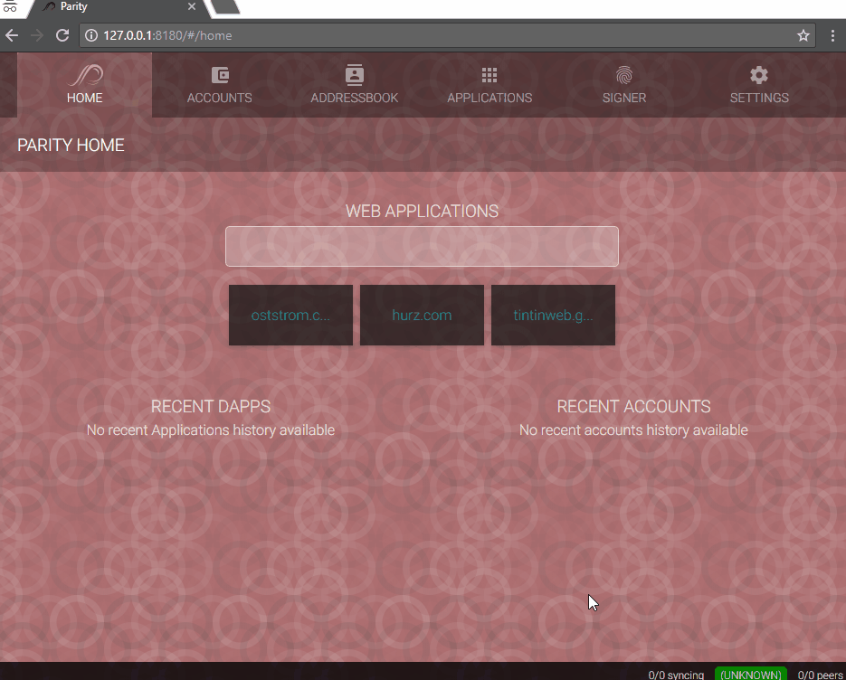
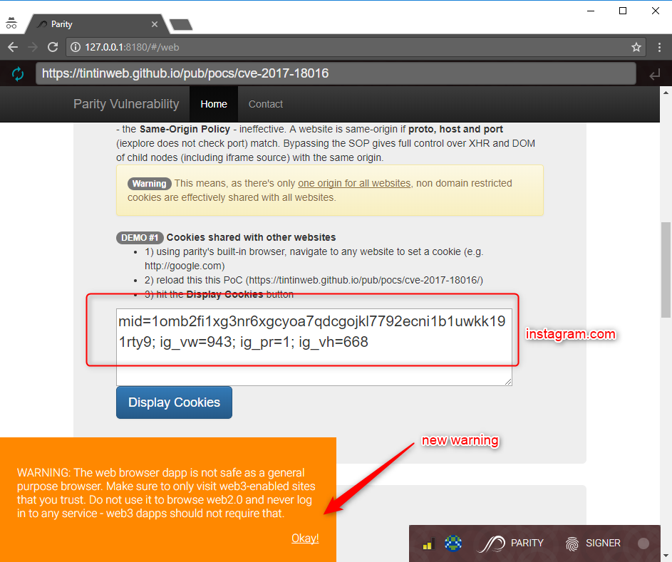

VuNote
======

    Author:     <github.com/tintinweb>
    Ref:        https://github.com/tintinweb/pub/tree/master/pocs/cve-2017-18016
    Version:    0.3
    Date:       Jun 16th, 2017
    
    Tag:        parity same origin policy bypass webproxy token reuse

Overview
--------

    Name:           parity
    Vendor:         paritytech
    References:     * https://parity.io/ [1]
    
    Version:        1.6.8
    Latest Version: 1.7.12 (stable) - fixed
                    1.8.5 (beta) - fixed
    Other Versions: <= 1.6.10 (stable) - vulnerable
    Platform(s):    cross
    Technology:     rust js

    Vuln Classes:   CWE-346
    Origin:         remote
    Min. Privs.:    ---

    CVE:            CVE-2017-18016

Description
---------

quote website [1]

>Parity Technologies is proud to present our powerful new Parity Browser. Integrated directly into your Web browser, Parity is the fastest and most secure way of interacting with the Ethereum network.

Summary 
-------

PoC: https://tintinweb.github.io/pub/pocs/cve-2017-18016/ [4]

> Parity Browser <=1.6.8 allows remote attackers to bypass the Same Origin Policy and obtain sensitive information by requesting other websites via the Parity web proxy engine (reusing the current website's token, which is not bound to an origin).

**(A)** Ethereum Parity's built-in dapp/web-browsing functionality is  
rendering browser same-origin policy (SOP) ineffective by proxying 
requests with the parity main process. As a result, any website 
navigated to ends up being origin http://localhost:8080. This also means
that all websites navigated to share the same origin and thus are not 
protected by the browser SOP allowing any proxied website/dapp to access
another proxied website/dapp's resources (Cookies, ...).

//see attached PoC - index.html / PoC

**(B)** Worse, due to the structure of proxy cache urls and the fact that they 
contain a reusable non-secret non-url specific cache-token it is 
possible for one proxied website/dapp to navigate to any other proxied
website/dapp gaining full script/XHR control due to **(A)** the SOP being
applied without any restrictions. This could allow a malicious
website/dapp to take control of another website/dapp, performing user
interactions, XHR or injecting scripts/DOM elements to mislead the
user or to cause other unspecified damage.

When navigating to a website with the built-in parity webbrowser a webproxy request
token is requested and sent along an encoded request for an url. For example, navigating
parity to http://oststrom.com the url gets turned into a proxy url like http://127.0.0.1:8080/web/8X4Q4EBJ71SM2CK6E5AQ6YBNB4NPGX3ME0X2YBVFEDT76X3JDXPJWRVFDM of
the form http://127.0.0.1:8080/web/[base32_encode(token+url)]. A malicious dapp can use
this information to decode its own url, extract the token and reuse it for any other 
url as the token is not locked to the url. The PoC exploits this in order to load any
other website into a same-origin iframe by reusing the proxy token.

Code see [2]

//see attached PoC - index.html / PoC
    

Proof of Concept
----------------

Prerequisites: 

* (if hosted locally) modify /etc/hosts to resolve your testdomain to your webserver
* make `index.html` accessible on a webserver (e.g. `cd /path/to/index.html; python -m SimpleHTTPServer 80`)

1. launch parity, navigate to the built-in webbrowser (http://127.0.0.1:8180/#/web)
2. navigate the built-in parity webbrowser to where the PoC `index.html` is hosted (e.g. [4])
3. follow the instructions. 
4. Issue 1: navigate to some websites to have them set cookies, reload the PoC page and click "Display Cookies". Note that while the main request is proxied by parity, subsequent calls might not be (e.g. xhr, resources). That means you'll only see cookies set by the main site as only the initial call shares the origin `localhost:8080`.
5. Issue 2: enter an url into the textbox and hit `Spawn SOP Iframe`. A new iframe will appear on the bottom of the page containing the proxied website. Note that the calling website has full script/dom/xhr access to the proxied target. You can also use the "Display Cookies" button from Issue 1 to show cookies that have been merged into the origin by loading the proxied iframe.
6. Demo 2: Just a PoC to find local-lan web interfaces (e.g. your gateways web interface) and potentially mess with its configuration (e.g. router with default password on your lan being reconfigured by malicious dapp that excploits the token reuse issue 2)

//tested with latest chrome

 
Notes
-----

* Commit [3] (first in 1.7.0)
* Does not fix Issue #1 - sites are generally put into same origin due to proxy
* Fixes Issue #2 - Token Reuse
* Parity now added a note that browsing websites with their browser is insecure

* Issue #1 is not yet fixed as the cookie of instagram.com is still shown.
* Parity v1.7.12 added a note.

Timeline
--------

    31.05.2017 - first contact, forwarded to parity
    17.06.2017 - provided PoC
    19.06.2017 - response: not critical issue due to internal browser being a dapp browser and not a generic web browser
    20.06.2017 - provided more information
    21.06.2017 - response: not critical issue due to internal browser being a dapp browser and not a generic web browser
    21.06.2017 - response: follow-up - looking into means to lock the token to a website
    22.06.2017 - fix ready [3]
    10.01.2018 - public disclosure

References
----------

    [1] https://parity.io/
    [2] https://github.com/paritytech/parity/blame/e8b418ca03866fd952d456830b30e9225c81035a/dapps/src/web.rs
    [3] https://github.com/paritytech/parity/commit/53609f703e2f1af76441344ac3b72811c726a215
    [4] https://tintinweb.github.io/pub/pocs/cve-2017-18016/

Contact
-------

    https://github.com/tintinweb
